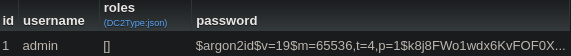

# Evil User Story

_**Evil User Story** d'après la proposition de **schoolalexis**_

"_En tant que **personne malveillante**, je veux **avoir accès à la base de données** afin d'*exploiter les mots de passe et autres données ci-trouvant**_"

**Contre-mesure** : En tant que **développeur**, afin d'**empêcher des personnes malveillantes qui souheraient, à partir de la base de données, exploiter leurs mots de passe** (dans le cas de l'application Vetux Line et des demandes pour celle-ci) **je créé les identifiants de connexions dès le lancement de l'application (et non au travers d'un système CRUD)**.
Pour cela, j'utilise le bundle `fixture`, qui lors du chargement des entités créé l'utilisateur.

Exemple :

```php
<?php
// src/DataFixtures/AppFixtures.php
namespace App\DataFixtures;

use Doctrine\Bundle\FixturesBundle\Fixture;
use Doctrine\Persistence\ObjectManager;
use Symfony\Component\Security\Core\Encoder\UserPasswordEncoderInterface;
use App\Entity\Admin;

class AppFixtures extends Fixture
{

    private $passwordEncoder;

    public function __construct(UserPasswordEncoderInterface $passwordEncoder){
        $this->passwordEncoder = $passwordEncoder;
    }

    public function load(ObjectManager $manager): void
    {
        $user = new Admin();
        $user->setUsername("admin");
        // method n°1
        $user->setPassword($this->passwordEncoder->encodePassword($user, "admin"));
        $manager->persist($user);
        $manager->flush();
    }
}
```

Cette solution donnant un identifiant à la fin, dans la base de données :



Ainsi un **individu malveillant** ne peut pas exploiter une faille dans le système de création d'identifiant, étant donné que celui-ci n'existe pas en externe/publique (côté client).